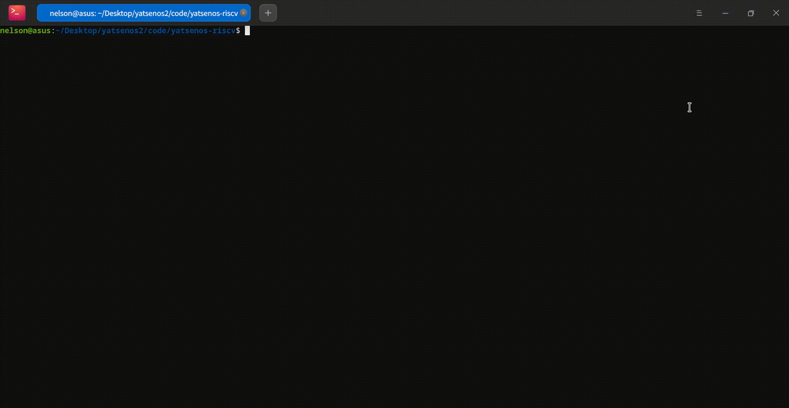
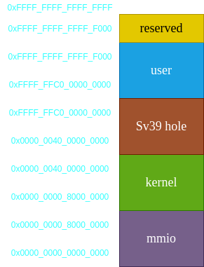
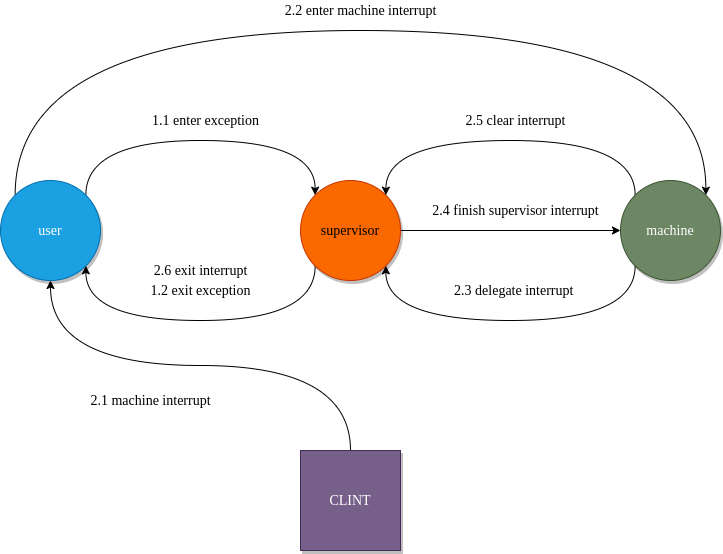

# YatSenOS RISC-V 64
> + Rebuild [YatSenOS](https://github.com/YatSenOS/YatSenOS-Tutorial-Volume-1) On RISC-V 64.
> + It is not be guaranteed that there are no bugs in the project :(
> + This REAME is too concise to understand the project. The detailed one is coming soon :) 

# Quick Start

首先安装riscv交叉编译工具链，安装方法可见博客 https://blog.nelson-cheung.cn/2021/12/16/riscv-toolchain-install-guide/ 。在项目目录下执行如下命令。

```shell
make && make run
```

可以看到输出如下。



OS最后只剩下两个进程分时共享处理器。目前只启动了一份用户程序进行验证，代码如下。~~（别问为什么，问就是懒~~

```cpp
#include "stdio.h"
#include "syscall.h"

int main()
{
    printf("你好，进程!\n");

    unsigned long pid = fork();

    if (pid == 0)
    {
        printf("子进程启动, pid: %ld\n", pid);
    }
    else if (pid > 0)
    {
        printf("父进程fork返回, pid: %ld\n", pid);
    }
    else
    {
        printf("发生错误\n");
    }

    while(true);
}
```

# Introduction

相比较于第一版的YatSenOS，修改如下。

+ 未实现用户线程和锁机制。
+ 加入了解析ELF文件加载进程的步骤。
+ 将用户态和内核态代码和实现完全隔离开来。
+ 实现了三种特权级之间的中断转发和嵌套机制。
+ 使用Sv39三级分页机制。
+ 重新设计64位进程地址空间排布。

项目的结构如下。

```
├── driver          驱动代码
├── gdbinit.txt     gdb指令，包括设置断点，连接target remote等，用于debug
├── include         头文件
├── kernel          内核代码实现
├── lib             用户标准库
├── LICENSE        
├── Makefile  
├── README.md
└── user            用户程序代码
```

各个子目录的文件描述如下。

| 文件                     | 描述           |
| ------------------------ | -------------- |
| `driver/clint.cpp`       | CLINT驱动实现  |
| `driver/driver.cpp`      | 驱动的集中定义 |
| `driver/timer.cpp`       | 时钟驱动实现 |
| `driver/uart.cpp`        | UART驱动实现 |
| `include/address_pool.h` | 资源池声明 |
| `include/bitmap.h`       | 位图声明 |
| `include/clint.h`        | CLINT驱动声明 |
| `include/constant.h`     | 常量声明 |
| `include/driver.h`       | 驱动管理器声明 |
| `include/interrupt.h`    | 中断管理器声明 |
| `include/list.h`         | 链表声明 |
| `include/mem.h`          | 内存管理器声明 |
| `include/object.h`       | 内核数据对象声明 |
| `include/pcb.h` | PCB声明 |
| `include/process.h` | 进程管理器声明 |
| `include/rv64.h` | RISC-V架构相关代码声明 |
| `include/stdarg.h` | 可变参数声明 |
| `include/stdio.h` | 用户标准库声明 |
| `include/syscall.h` | 系统调用声明 |
| `include/syscall_manager.h` | 系统调用管理器声明 |
| `include/timer.h` | 时钟驱动声明 |
| `include/uart.h` | UART驱动声明 |
| `include/user_process.h` | 用户程序声明 |
| `include/utils.h` | 工具函数声明 |
| `kernel/address_pool.cpp` | 资源池实现 |
| `kernel/asm_utils.s` | 汇编函数实现 |
| `kernel/bitmap.cpp` | 位图实现 |
| `kernel/init.cpp` | 内核初始化代码 |
| `kernel/interrupt.cpp` | 中断管理器实现 |
| `kernel/list.cpp` | 链表实现 |
| `kernel/mem.cpp` | 内存管理器实现 |
| `kernel/process.cpp` | 进程管理器实现 |
| `kernel/start.s` | 内核进入点 |
| `kernel/syscall_manager.cpp` | 系统调用管理器实现 |
| `kernel/utils.cpp` | 工具函数实现 |
| `lib/lib_utils.s` | 用户标准库汇编代码 |
| `lib/stdio.cpp` | 用户标准库实现 |
| `lib/syscall.cpp` | 用户系统调用实现 |

64位的进程地址空间排列如下。



和Linux定义的[Virual Memory Layout](https://www.kernel.org/doc/html/latest/riscv/vm-layout.html)不同，这里的Kernel被放在低地址，user被放在高地址。这样做的原因是`qemu`的`virt`板最开始会加载`-kernel`指定的`ELF`文件到`0x80000000`。在没有实现文件系统的情况下，必须将内核代码的起始地址设置为`0x80000000`，然后才可以让`qemu`正确加载内核。

还有一个原因是DRAM从`0x80000000`开始，建立了虚拟地址和物理地址的一一映射后，在内核中访问虚拟地址和物理地址是等同的。这可以为后面代码的编写带来方便。



对于qemu的`virt`板来说，其并没有完全实现RISC-V定义的中断转发机制。这就导致了machine mode的interrupt并不能被转发到supervisor mode中处理。而Kernel是运行在supervisor mode中的，也就是说，Kernel没有办法处理machine mode的interrupt。此时，可以通过设置`mip`来将中断转发到supervisor mode。但是，这会导致中断嵌套时保护现场和恢复现场存在问题。设想一个场景，user mode发送了一个ecall到supervisor中，而此时supervisor准备保存现场。但是，machine timer interrupt发生了，然后被转发到supervisor中。此时，supervisor timer interrupt会覆盖原来ecall设置的`sepc`、`scause`、`sstatus`，还有其他的寄存器。也就是说，在没有其他机制辅助的情况下，原来的ecall会被覆盖而无法被处理。此时，需要设计一个在machine、supervisor、user三者之间协同的中断转发机制来处理中断嵌套的问题。解决方法可以阅读源码，这里暂时按下不表。

详细的设计细节留到后面的文档再统一分析。

# References

1. In Praise of The RISC-V Reader [[PDF](https://www.cs.sfu.ca/~ashriram/Courses/CS295/assets/books/rvbook.pdf)]
2. Volume 1, Unprivileged Spec v. 20191213 [[PDF](https://github.com/riscv/riscv-isa-manual/releases/download/Ratified-IMAFDQC/riscv-spec-20191213.pdf)]
3. Volume 2, Privileged Spec v. 20211203 [[PDF](https://github.com/riscv/riscv-isa-manual/releases/download/Priv-v1.12/riscv-privileged-20211203.pdf)]
4. SiFive FU540-C000 Manual v1p0 [[PDF](https://static.dev.sifive.com/FU540-C000-v1.0.pdf)]
5. UART 16550 [[PDF](http://caro.su/msx/ocm_de1/16550.pdf)]
6. Xv6 [[LINK](https://github.com/mit-pdos/xv6-riscv)]
7. rcore [[LINK](https://rcore-os.github.io/rCore-Tutorial-Book-v3/)]
8. https://groups.google.com/a/groups.riscv.org/g/sw-dev/c/1gpj3Z9Aqew
9. https://twilco.github.io/riscv-from-scratch/2019/07/08/riscv-from-scratch-3.html
10. https://github.com/twilco/riscv-from-scratch
11. https://stackoverflow.com/questions/69133848/risc-v-illegal-instruction-exception-when-switching-to-supervisor-mode

